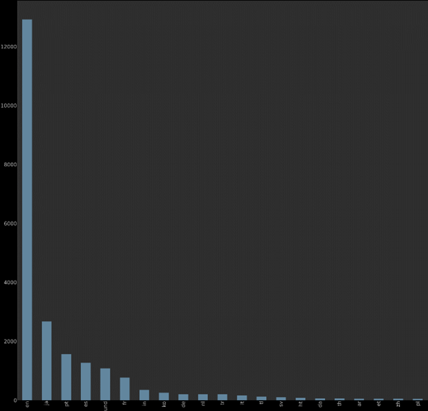
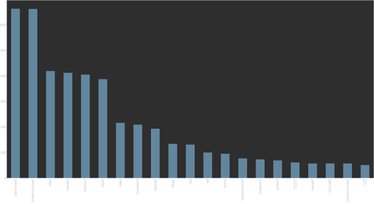
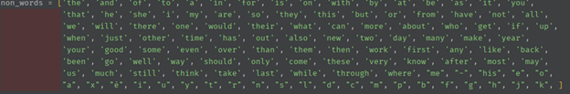
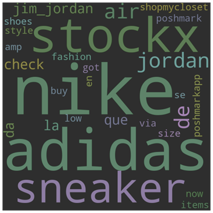
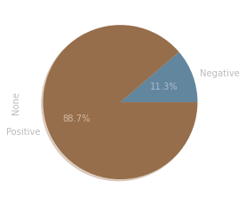

Moutaz Ali

CU1901903

Submitted to: Dr. Batoul Haidar

Big Data Analysis Project

Topic: Twitter Sentimental Analysis Based On Sneakers

# Contents

[Section 1: Data Collection &amp; Filtration](#Section-1:-Data-Collection-&amp;-Filtration)

[Section 2: Sentimental Analysis](#Section-2:-Sentimental-Analysis)

# Section 1: Data Collection &amp; Filtration

Firstly, The data for the project was gathered from twitter using the python library twint. The data was gathered from posts on sneakers using a specified wordlist, the tweets were then stored in a csv file. Thereafter, The program creates 3 graph based on the following data: tweet languages, common words and common hashtags. Furthermore, The tweet languages are loaded from the column language in the dataframe, sorted, counted by the frequency and finally displayed in a bar plot.

Moreover, the common hashtags were gathered by extracting the hashtags from the data frame and cleaning them of empty cells. After that the data is sorted, counted and then plotted in a bar graph.

Lastly, the common words were extracted from the tweet body column and filtered by only the words that are repeated more than 100 times. The words are then run through another filter that takes out the words that won&#39;t benefit in our search. Then they are finally counted and plotted in a word cloud graph. 

# Section 2: Sentimental Analysis

To begin with, The sentiment analysis of tweets scraped using twint involves two main python libraries, the first one is pandas which will allow us to convert the csv file containing the scraped tweets to a more usable form of a dataframe. The next package is textblob which is a text processing package for python, this package will be used to get the sentiment analysis data required.

The first cell in the notebook imports both these packages for use in the script, and the next cell initializes the dataframe which reads from the csv file containing the tweets extracted using twint. Then a new dataframe called df\_tweets is created with just the tweets from the original dataframe, all other attributes are removed. Then all empty rows are removed from the dataframe to avoid contaminating the dataset. The polarity of a certain piece of text determines whether the text has a negative or positive connotation and is represented by a float, if the polarity is positive then the text has a positive connotation, if the polarity is negative then the text has a negative connotation. The overall polarity of all tweets is initialized as zero so that all polarities can be added to that variable.

There are two more packages that are initialized, and these are &quot;re&quot; which is a regex module, and &quot;emoji&quot; which parses emojis. Then count variables for positive and negative tweets is also initialized. A for loop loops on the tweets and edits each tweet by using regex substitution to remove any data that might mess with the sentiment analysis (like emojis, ats, hashtag symbols, and links). Moreover, Textblob is then used to analyze the text, this analysis includes the sentiment analysis polarity which is added to the overall polarity and also added to the relevant count (positive or negative). The results are then displayed as a pie chart.

